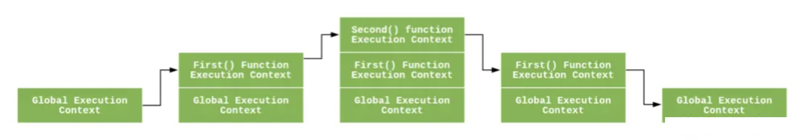

# Javascript 执行

在 javascript 执行之前，会先确定`作用域`和`执行栈`、`执行上下文`。

## 作用域

作用域是在运行时代码中的某些特定部分中变量，函数和对象的可访问性。换句话说，作用域决定了代码区块中变量和其他资源的可见性。在`javascript`中的作用域是`词法作用域`，即由函数声明时所在的位置决定的（区别于词法作用域，动态作用域是在函数执行的时候确认的，`js` 没有动态作用域，但 `js` 的 `this` 很像动态作用域）。

看个例子：

```js
function showName() {
  const name = '奥特曼';
  console.log(name); // 奥特曼
}
console.log(name); // Uncaught ReferenceError: name is not defined
```

在 js 当中，根据可访问范围，作用域可分为`全局作用域`和`局部作用域`。上面的例子中，由于`name`在全局作用域没有声明，所以在全局作用域下取值会报错。

- `全局作用域`是指变量可以在当前脚本的任意位置访问。
- `局部作用域`：只作用于函数内部，只能在函数内部访问。

### 词法环境 Lexical Environment（词法作用域）

`Lexical Environment` 制订了 JavaScript 引擎如何根据标识符名称查找变量的规则和机制，因此它维护了一个 `Identifier-Variable` 的映射结构（Environment Record）来进行管理： 这里的 `Identifier` 是指变量或者函数标识符的名字，`Variable` 是指对应变量的引用（可以是对象，函数，基本值）。

通常情况下，词法环境总是和一些特定的语法结构相关联，例如函数声明（非执行），代码块，try..catch 结构的 catch 块等。

每当执行到这些代码片段，JavaScript 就会创建一个新的词法环境，用于记录和存储当前执行代码中所声明的变量，函数（包括函数入参）的对象。 通过 Lexical Environment 以及对应执行环境下的词法/变量对象，构建了 JavaScript 变量作用域的概念。

除此之外，`Lexical Environment` 还维护了一个指针引用 `Outer Environment Reference`，它指向了当前词法环境外部词法环境。 通过 `Outer Environment Reference` ，有嵌套代码结构的词法环境被（单向）串接了起来，从而形成了`作用域链`的设计。

### 作用域链

`作用域链`定义了当变量在当前上下文访问不到的时候如何沿作用域链继续查询的一套规则。

`全局变量`是可以被所有`局部作用域`所访问的，相反`全局作用域`是无权访问`局部变量`的，同一作用域下， 里层的`局部作用域`可以访问外层的`局部变量`，反之不行，即越靠里面作用域权限越大。

## 执行栈

`执行栈`，是一种拥有 LIFO（后进先出）数据结构的栈，被用来存储代码运行时创建的所有执行上下文（执行环境）。

当 JavaScript 引擎第一次遇到你的脚本时，它会创建一个全局的`执行上下文（执行环境）`并且压入当前执行栈。每当引擎遇到一个函数调用，它会为该函数创建一个新的`执行上下文（执行环境）`并压入栈的顶部。

以下面的代码为例：

```js
const a = 'Hello World!';

function first() {
  console.log('Inside first function');
  second();
  console.log('Again inside first function');
}

function second() {
  console.log('Inside second function');
}

first();
console.log('Inside Global Execution Context');
```

<br />


- 当上述代码在浏览器加载时，JavaScript 引擎创建了一个全局执行上下文并把它压入当前执行栈。

- 当遇到 first() 函数调用时，JavaScript 引擎为该函数创建一个新的执行上下文并把它压入当前执行栈的顶部。

- 当从 first() 函数内部调用 second() 函数时，JavaScript 引擎为 second() 函数创建了一个新的执行上下文并把它压入当前执行栈的顶部。

- 当 second() 函数执行完毕，它的执行上下文会从当前栈弹出，并且控制流程到达下一个执行上下文，即 first() 函数的执行上下文。

- 当 first() 执行完毕，它的执行上下文从栈弹出，控制流程到达全局执行上下文。

- 一旦所有代码执行完毕，JavaScript 引擎从当前栈中移除全局执行上下文。

## 执行上下文（执行环境）

`执行上下文`是指 函数调用时 在`执行栈`中产生的变量对象，这个变量对象我们无法直接访问，但是可以访问其中的变量、this 对象等。[参考](https://chenzhuo1024.github.io/tech/js/js-context.html)
