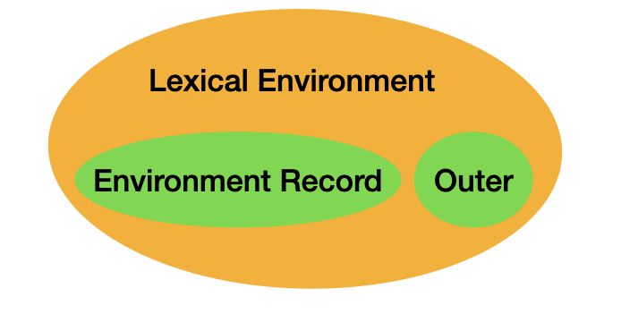
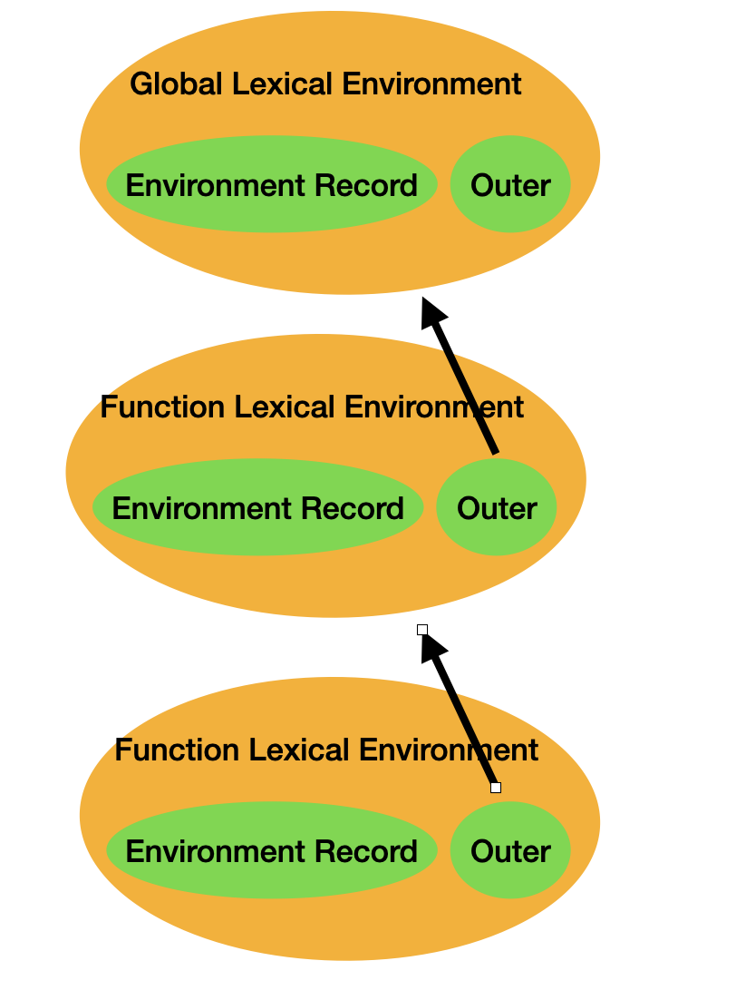

# Javascript 执行

在 javascript 执行之前，会先确定`作用域`和`执行栈`、`执行上下文`。

## 作用域

作用域是在运行时代码中的某些特定部分中变量，函数和对象的可访问性。换句话说，作用域决定了代码区块中变量和其他资源的可见性。在`javascript`中的作用域是`词法作用域`，即由函数声明时所在的位置决定的（区别于词法作用域，动态作用域是在函数执行的时候确认的，`js` 没有动态作用域，但 `js` 的 `this` 很像动态作用域）。

看个例子：

```js
function showName() {
  const name = '奥特曼';
  console.log(name); // 奥特曼
}
console.log(name); // Uncaught ReferenceError: name is not defined
```

在 js 当中，根据可访问范围，作用域可分为`全局作用域`和`局部作用域`。上面的例子中，由于`name`在全局作用域没有声明，所以在全局作用域下取值会报错。

- `全局作用域`是指变量可以在当前脚本的任意位置访问。
- `局部作用域`只作用于函数内部，只能在函数内部访问。

**在 ES5 后，Scope 被替代为 Environment，Environment 取代了作用域，称为 `Lexical Environment（词法环境）`。**

## 词法环境 Lexical Environment（词法作用域）

`Lexical Environment` 制订了 JavaScript 引擎如何根据标识符名称查找变量的规则和机制，因此它维护了一个 `Identifier-Variable` 的映射结构（Environment Record）来进行管理： 这里的 `Identifier` 是指变量或者函数标识符的名字，`Variable` 是指对应变量的引用（可以是对象，函数，基本值）。

通常情况下，词法环境总是和一些特定的语法结构相关联，例如函数声明（非执行），代码块，try..catch 结构的 catch 块等。

每当执行到这些代码片段，JavaScript 就会创建一个新的词法环境，用于记录和存储当前执行代码中所声明的变量，函数（包括函数入参）的对象。

词法环境有两大成员：`Environment Record（环境记录）`，可能为 null 的 `Outer Lexical Environment（外部词法环境引用）`。



### Outer Lexical Environment（外部词法环境引用）

`Lexical Environment` 维护了一个指针引用 `Outer Environment Reference`，它指向了当前词法环境外部词法环境。 通过 `Outer Environment Reference` ，有嵌套代码结构的词法环境被（单向）串接了起来，从而形成了`作用域链`的设计。

以下面例子为例：

```js
// Global Lexical Environment
function a() {
  // Function Lexical Environment
  function b() {
    // Function Lexical Environment
  }
}
```

分析（以下代码不考虑函数运行时机）:

- 进入代码，创建全局词法环境。
- 向下执行，读到 a 函数声明，则创建 a 函数词法环境，且 Outer 指向全局词法环境。
- 继续向下执行，读到 b 函数声明，则创建 b 函数词法环境，且 Outer 指向 b 函数词法环境。



### Environment Record

记录在其关联的词法环境范围内创建的标识符绑定。`Environment Records` 是一个抽象类，存在三个具体的子类，`Declarative Environment Record` ，`Object Environment Record`，`Global Environment Record（全局环境记录）`。

## LexicalEnvironment 与 VariableEnvironment

`LexicalEnvironment` 中记录 `let`、`const` 等声明，`VariableEnvironment` 则仅处理 VariableStatements 即 `var` 声明。

## 作用域链

`作用域链`定义了当变量在当前上下文访问不到的时候如何沿作用域链继续查询的一套规则。

由于每个词法环境的 Outer 记录了外层词法环境的引用，当在自身词法环境记录无法寻找到该标识符时，可以根据 Outer 向外层寻找，直到 null（有木有觉得很像[[Prototype]]，自身寻找不到属性，则沿着[[Prototype]]查找，直到 null）

## 执行栈

`执行栈`，是一种拥有 LIFO（后进先出）数据结构的栈，被用来存储代码运行时创建的所有执行上下文（执行环境）。

当 JavaScript 引擎第一次遇到你的脚本时，它会创建一个全局的`执行上下文（执行环境）`并且压入当前执行栈。每当引擎遇到一个函数调用，它会为该函数创建一个新的`执行上下文（执行环境）`并压入栈的顶部。

以下面的代码为例：

```js
const a = 'Hello World!';

function first() {
  console.log('Inside first function');
  second();
  console.log('Again inside first function');
}

function second() {
  console.log('Inside second function');
}

first();
console.log('Inside Global Execution Context');
```

<br />


- 当上述代码在浏览器加载时，JavaScript 引擎创建了一个全局执行上下文并把它压入当前执行栈。

- 当遇到 first() 函数调用时，JavaScript 引擎为该函数创建一个新的执行上下文并把它压入当前执行栈的顶部。

- 当从 first() 函数内部调用 second() 函数时，JavaScript 引擎为 second() 函数创建了一个新的执行上下文并把它压入当前执行栈的顶部。

- 当 second() 函数执行完毕，它的执行上下文会从当前栈弹出，并且控制流程到达下一个执行上下文，即 first() 函数的执行上下文。

- 当 first() 执行完毕，它的执行上下文从栈弹出，控制流程到达全局执行上下文。

- 一旦所有代码执行完毕，JavaScript 引擎从当前栈中移除全局执行上下文。

## 执行上下文

`执行上下文`是指 函数调用时 在`执行栈`中产生的变量对象，这个变量对象我们无法直接访问，但是可以访问其中的变量、this 对象等。

执行上下文主要有两个阶段：

- 创建
- 执行

### 创建阶段

### 创建词法环境

在代码片段执行之前的编译阶段(词法分析，语法分析以及机器码生成)，会收集相应词法环境信息。 以函数声明为例，这个过程如下：

- 首先需要创建一个 arguments object 对象，用于保存函数入参对象， 完成对入参的初始化.
- 扫描遍历并查找函数体中声明的函数和变量（注意表达的次序），初始化后保存在变量对象中.

编译结束后，这部分数据信息都被保存在相应的 `AST` 节点中。

当执行上下文创建的时候会根据 `AST` 节点上的词法环境信息创建对应的词法环境（与执行上下文一一对应）。

因此，咱们可以将创建阶段表示为：

```js
// 全局执行上下文创建
GlobalExectionContext = {
	LexicalEnvironment: {
		EnvironmentRecord: {
			Type: "Object",
			a: <uninitiallized>, // 创建阶段的a未初始化
			b: <uninitiallized>, // 创建阶段的b未初始化
			mutiply: <func>
		}
		outer: <null>,
		ThisBinding: <Global Object>
	},
	VariableEnvironment: {
		EnvironmentRecord: {
			Type: "Object",
			c: undefined, // 创建阶段c已初始化，但未赋值
		}
		outer: <null>,
		ThisBinding: <Global Object>
	}
}
// 局部执行上下文创建
FunctionExectionContext = {
	LexicalEnvironment: {
		EnvironmentRecord: {
			Type: "Declarative",
			Arguments: {0: 20, 1: 30, length: 2},
		}
		outer: <GlobalLexicalEnvironment>,
		ThisBinding: <Global Object or undefine>
	},
	VariableEnvironment: {
		EnvironmentRecord: {
			Type: "Declarative",
			g: undefined,
		}
		outer: <GlobalLexicalEnvironment>,
		ThisBinding: <Global Object or undefine>
	}
}
```

### 执行阶段

这是代码开始在创建阶段形成的执行上下文中运行的阶段，并逐行分配变量值。

因此根据创建阶段，可将执行阶段表示为：

```js
// 全局执行上下文执行
GlobalExectionContext = {
	LexicalEnvironment: {
		EnvironmentRecord: {
			Type: "Object",
			a:  20, // 变量已赋值
			b: 30,  // 变量已赋值
			mutiply: <func>
		}
		outer: <null>,
		ThisBinding: <Global Object>
	},
	VariableEnvironment: {
		EnvironmentRecord: {
			Type: "Object",
			c: undefined,
		}
		outer: <null>,
		ThisBinding: <Global Object>
	}
}
// 局部执行上下文执行
FunctionExectionContext = {
	LexicalEnvironment: {
		EnvironmentRecord: {
			Type: "Declarative",
			Arguments: {0: 20, 1: 30, length: 2},
		}
		outer: <GlobalLexicalEnvironment>,
		ThisBinding: <Global Object or undefine>
	},
	VariableEnvironment: {
		EnvironmentRecord: {
			Type: "Declarative",
			g: 20,
		}
		outer: <GlobalLexicalEnvironment>,
		ThisBinding: <Global Object or undefine>
	}
}
```
