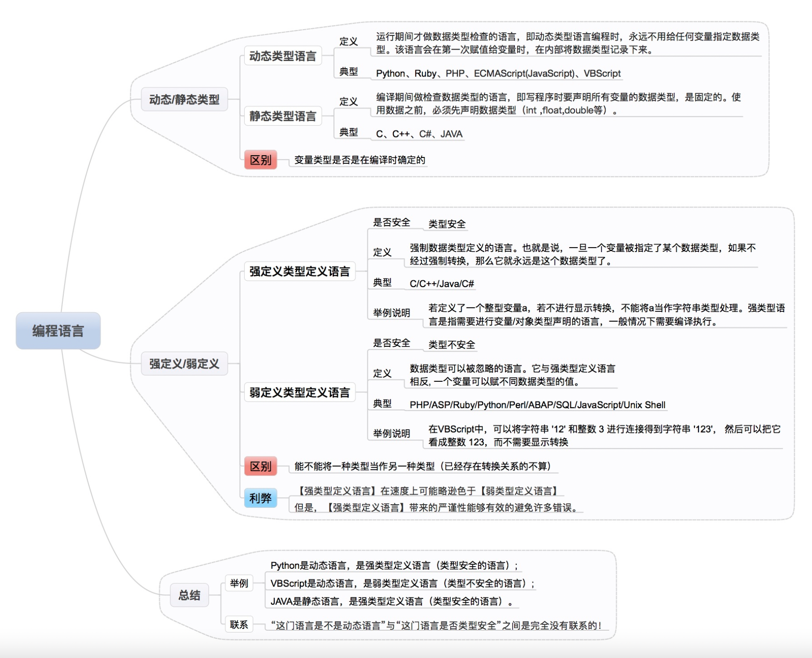

# javascript 编译原理

## 什么是弱类型、强类型、动态类型、静态类型

见下图：



## 编译型语言 vs 解释型语言

`编译型语言`在代码运行前编译器直接将对应的代码转换成机器码，运行时不需要再重新翻译，直接可以使用编译后的结果。

`解释型语言`也是需要将代码转换成机器码，但是和编译型的区别在于运行时需要转换。比较显著的特点是，解释型语言的执行速度要慢于编译型语言，因为解释型语言每次执行都需要把源码转换一次才能执行。

所以执行前需要解释器安装在环境中；但是编译型语言编写的应用在编译后能直接运行。

## javascript 是动态类型、弱类型、解释执行语言

虽然通常将 js 归类为“动态”或“解释执行”语言，但其实也可把它看成是一门编译语言。

只不过这个所谓的编译与传统的编译语言不同，它不是提前编译的，编译结果也不能在分布式系统中进行移植。对于 js 来说，它的编译过程不是发生在构建之前的，大部分情况下编译发生在代码执行前的几微秒甚至更短的时间内，甚至是代码执行中。

## 编译原理

`JavaScript 引擎（V8）`进行编译的步骤和传统的编译语言非常相似，但在在某些环节可能比预想的要复杂，这里不多赘述。在传统编译语言的流程中，程序中的一段源代码在执行之前会经历三个步骤，统称为“编译”:

- 分词 / 词法分析
- 解析 / 语法分析
- 代码生成

### 分词和词法分析

`词法分析（Tokenizing / Lexing）`这个过程会将由字符组成的字符串分解成有意义的代码块（对编程语言来说），这些代码块被称为 `词法单元（Token）`。

```js
const a = 2;
```

这段程序通常会被分解成为下列词法单元：var、a、=、2、;。

空格是否会被当作词法单元，取决于空格在这门语言中是否具有意义。

`分词（Tokenizing）`和`词法分析（Lexing）`之间的主要差异在于词法单元的识别是通过有状态还是无状态的方式进行的。简单来说，如果词法单元生成器在判断 a 是一个独立的词法单元还是其他词法单元的一部分时，调用的是 `有状态的解析规则`，那么这个过程就被称为 `词法分析`。

### 解析和语法分析

`语法分析（Parsing）` 这个过程是将词法单元流转换成一个 由元素逐级嵌套所组成 的代表了程序语法结构的树。这个树被称为 `抽象语法树`（Abstract Syntax Tree，AST 在各大框架及 Babel 中我们都会看到它的身影）。

### 代码生成

将 `AST` 转换为可执行代码的过程被称为 `代码生成`。这个过程与语言、目标平台等息息相关。 抛开具体细节，简单来说就是有某种方法可以将 var a = 2; 的 `AST` 转化为一组 `机器指令`：创建一个叫做 a 的变量（包括 分配内存 等），并将一个值存储在变量 a 中。

通过上述三个阶段，浏览器已经可以运行我们得到的 可执行代码，这三个阶段还有一个合称叫 `编译阶段`。
