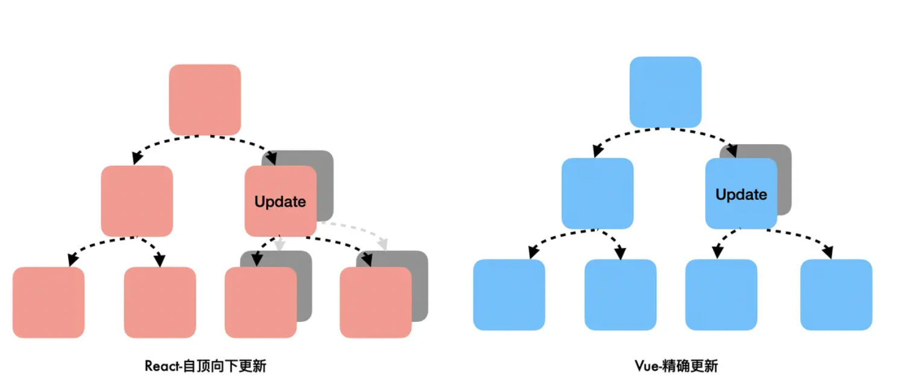

# 有 react fiber，为什么不需要 vue fiber 呢？

**原因：`react` 和 `vue` 的视图更新机制不一样，本质还是两者的响应式原理存在差异。**

## 响应式原理

- Vue 基本上是一套基于 getter/setter 实现的依赖收集/依赖更新的订阅式机制。
- React 则是通过显式的触发函数调用来更新数据，比如 setState。

相比来说 `Vue` 的实现方式更细粒度一些， 通过依赖收集，`Vue` 是能够知道一些数据的更新导致了哪些地方需要重新计算的，通过这种机制，`Vue` 能够优雅地实现计算属性、watch，包括视图渲染。而 `React`，调用 `setState` 方法后，会自顶向下重新渲染组件，自顶向下的含义是，该组件以及它的子组件全部需要渲染，由于缺少这种细粒度的机制，则更多时候需要一些其它方案来提高性能，于是产生了如 `PureComponent`、`ImmutableJS`、`shouldComponentUpdate` 钩子等等。

## 视图更新流程

不管是`vue`和`react`, 每次的视图更新流程基本是一样的。

- 组件渲染生成一棵新的虚拟 dom 树；
- 新旧虚拟 dom 树对比，找出变动的部分；（也就是常说的 diff 算法）
- 为真正改变的部分创建真实 dom，把他们挂载到文档，实现页面重渲染；

在数据更新时，`react` 生成了一棵更大的虚拟 dom 树，给第二步的 diff 带来了很大压力——我们想找到真正变化的部分，这需要花费更长的时间。js 占据主线程去做比较，渲染线程便无法做其他工作，用户的交互得不到响应，所以便出现了 `react fiber`

`react fiber` 没法让比较的时间缩短，但它使得 diff 的过程被分成一小段一小段的，因为它有了“保存工作进度”的能力。js 会比较一部分虚拟 dom，然后让渡主线程，给浏览器去做其他工作，然后继续比较，依次往复，等到最后比较完成，一次性更新到视图上。

## 总结

`react` 因为先天的不足——无法精确更新，所以需要 react fiber 把组件渲染工作切片；而 `vue` 基于数据劫持，更新粒度很小，没有这个压力。
