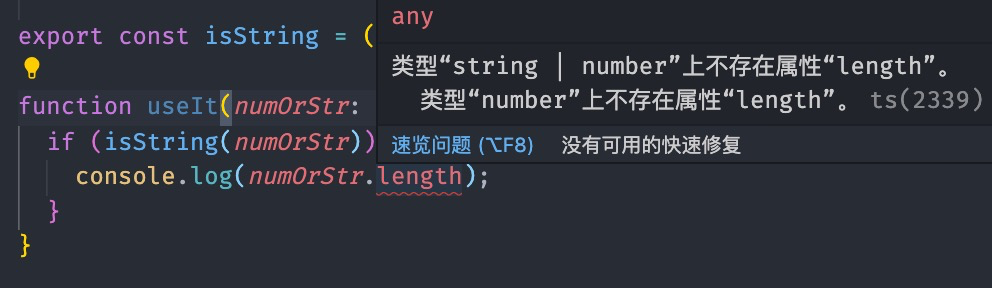

# 类型编程——入门

## 索引类型与映射类型

现在实现一个简单的函数:

```js
// 获取对象的value
function pickSingleValue(obj, key) {
  return obj[key];
}
```

要为其进行类型定义的话，需要定义的地方有如下：

- 参数 `obj`
- 参数 `key`
- 返回值

上面三者之间存在如下关系：

- key 必然是 obj 中的键值名之一，一定为 string 类型
- 返回的值一定是 obj 中的键值

因此我们得到这样的结果：

```ts
function pickSingleValue<T, K extends keyof T>(obj: T, key: K): T[K] {
  return obj[key];
}
```

### keyof

`keyof` 是 索引类型查询的语法， 它会返回后面跟着的类型参数的键值组成的字面量类型。

```
interface foo {
  a: number;
  b: string;
}

type A = keyof foo; // "a" | "b"
```

### 索引签名 Index Signature

索引签名用于快速建立一个内部字段类型相同的接口，如：

```ts
interface Person {
  [keys: string]: string;
}
```

那么接口 `Person` 就被认定为字段全部为 string 类型。

### 映射类型 Mapped Types

映射类型同样是类型编程的重要底层组成，通常用于在旧有类型的基础上进行改造，包括接口包含字段、字段的类型、修饰符（只读 readonly 与 可选?）等等。

从一个简单场景入手：

```ts
interface A {
  a: boolean;
  b: string;
  c: number;
  d: () => void;
}
```

现在有个需求，实现一个接口，它的字段与接口 A 完全相同，但是其中的类型全部为 string。具体实现如下：

```ts
type StringifyA<T> = {
  [K in keyof T]: string;
};
```

`映射类型`是将一个类型映射成另一个类型，关键字`in`、`keyof`是其中的关键。

## 条件类型 Conditional Types

条件类型的语法实际上就是三元表达式：

```ts
T extends U ? X : Y
```

`extends`表示泛型约束，例如 `K extends keyof T`表示泛型 `K` 必然是泛型 `T` 的键名组成的联合类型。

下面是一个使用条件类型作为函数返回值类型的例子：

```ts
declare function strOrNum<T extends boolean>(
  x: T,
): T extends true ? string : number;
```

在这种情况下，条件类型的推导就会被延迟，因为此时类型系统没有足够的信息来完成判断。只有给出了所需信息（在这里是入参 x 的类型），才可以完成推导。

同样的，就像三元表达式可以嵌套，条件类型也可以嵌套，如果你看过一些框架源码，也会发现其中存在着许多嵌套的条件类型，无他，条件类型可以将类型约束收拢到非常精确的范围内。

```ts
type TypeName<T> = T extends string
  ? 'string'
  : T extends number
  ? 'number'
  : T extends boolean
  ? 'boolean'
  : T extends undefined
  ? 'undefined'
  : T extends Function
  ? 'function'
  : 'object';
```

## 分布式条件类型 Distributive Conditional Types

对于属于裸类型参数的检查类型，条件类型会在实例化时期自动分发到联合类型上。

- 裸类型参数，没有额外被接口/类型别名/奇怪的东西包裹过的。
- 实例化，其实就是条件类型的判断过程，就像我们前面说的，条件类型需要在收集到足够的推断信息之后才能进行这个过程。
- 分发至联合类型的过程：

```ts
( A | B | C ) extends T ? X : Y
// 相当于
(A extends T ? X : Y) | (B extends T ? X : Y) | (B extends T ? X : Y)
```

一句话概括：**没有被额外包装的联合类型参数，在条件类型进行判定时会将联合类型分发，分别进行判断。**

## infer 关键字

`infer` 是 `inference` 的缩写，通常的使用方式是 infer R，R 表示 待推断的类型。

获取函数返回值类型的工具类型 ReturnType:

```ts
const foo = (): string => {
  return 'linbudu';
};

// string
type FooReturnType = ReturnType<typeof foo>; // string
```

类型系统在获得足够的信息后，就能将 infer 后跟随的类型参数推导出来。

```ts
type ReturnType<T> = T extends (...args: any[]) => infer R ? R : any;
```

- `(...args: any[]) => infer R` 是一个整体，这里函数的返回值类型的位置被 infer R 占据了。
- 当 `ReturnType` 被调用，泛型 T 被实际类型填充，如果 T 满足条件类型的约束，就返回 R 的值，在这里 R 即为函数的返回值实际类型。

## 类型守卫之关键字 is

假设有这么一个字段，它可能字符串也可能是数字：

```ts
numOrStrProp: number | string;
```

现在在使用时，想将这个字段的联合类型缩小范围，比如精确到 string，可能会这么写：

```ts
export const isString = (arg: unknown): boolean => typeof arg === 'string';
```



实际上没有达到想要的效果。

看起来 `isString` 函数并没有起到缩小类型范围的作用，参数依然是联合类型。这个时候就该使用 `is` 关键字了。

```ts
export const isString = (arg: unknown): arg is string =>
  typeof arg === 'string';
```

这个时候再去使用，就会发现在 isString(numOrStr)为 true 后，numOrStr 的类型就被缩小到了 `string`。
