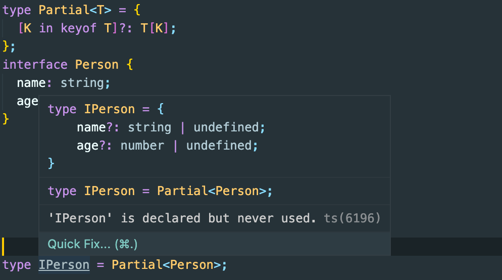
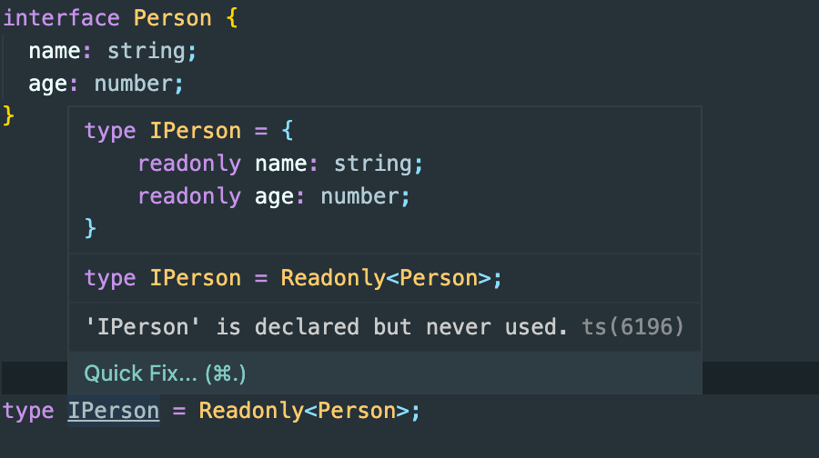
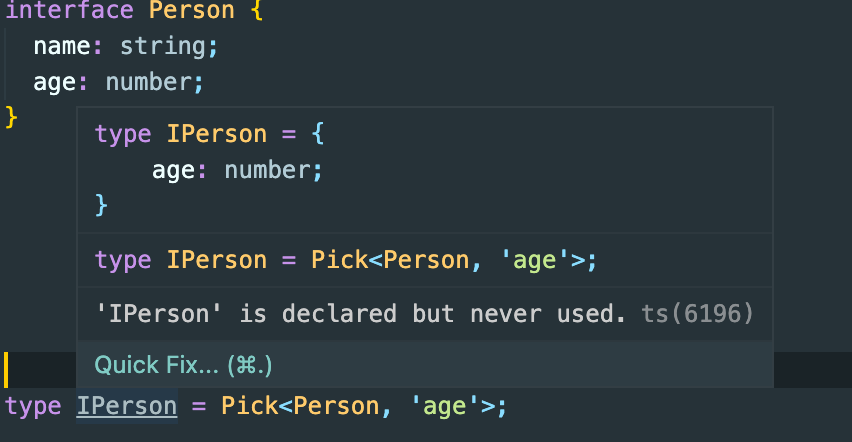
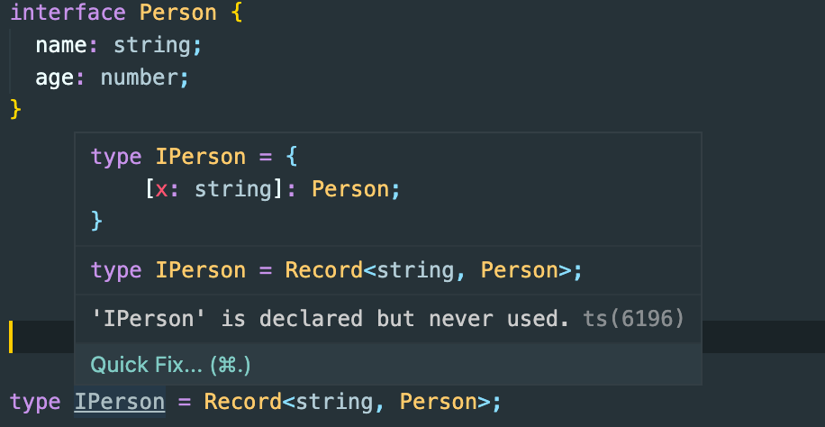
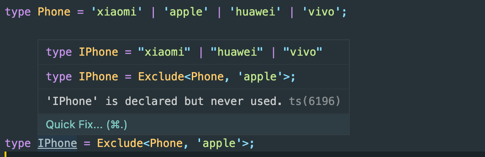
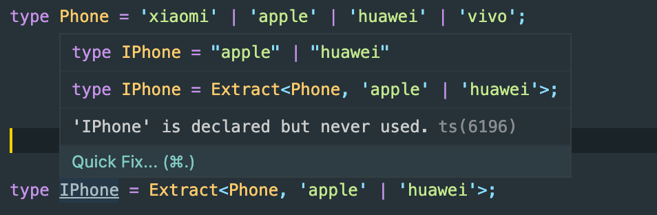

# 类型编程——实战

## Partial

将一个接口中的字段变为全部可选。

```ts
type Partial<T> = {
  [K in keyof T]?: T[K];
};
```

<br />


## Readonly

将 T 的所有属性映射为只读的。原理同`Partial`

```ts
type Readonly<T> = {
  readonly [K in keyof T]: T[K];
};
```

<br />


## Pick

用于抽取对象子集，挑选一组属性并组成一个新的类型

```ts
type Pick<T, S extends keyof T> = {
  [K in S]: T[K];
};
```

Pick 映射类型有两个参数:

- 第一个参数 T，表示要抽取的目标对象
- 第二个参数 S，具有一个约束：S 一定要来自 T 所有属性字面量的联合类型

<br />


## Record

创建新属性的非同态映射类型。

```ts
type Record<K extends keyof any, T> = {
  [key in K]: T;
};
```

Record 映射类型有两个参数:

- 第一个参数可以传入继承于 any 的任何值
- 第二个参数，作为新创建对象的值，被传入。

<br />


## Exclude

Exclude 意思是不包含。

```ts
type Exclude<T, U extends T> = T extends U ? never : T;
```

`Exclude<T, U>` 会返回 联合类型 `T` 中不包含 联合类型 `U`的部分。

<br />


## Extract

`Extract<T, U>`提取联合类型 `T` 和联合类型 `U` 的所有交集。

```ts
type Extract<T, U extends T> = T extends U ? T : never;
```

<br />

