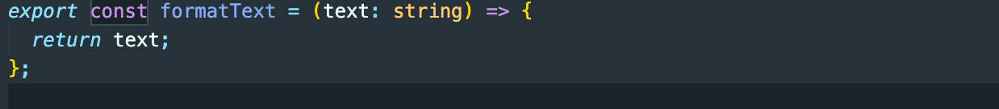
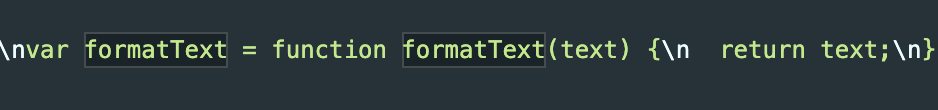

# 从零到一配置 webpack

## 基础配置

- **1、安装`webpack`,`webpack-cli`。**

```
npm install webpack webpack-cli -D
```

- **2、创建`webpck`配置文件,一般我们会把 webpack 的公共配置抽离出来，然后分为`开发环境`和`生产环境`。**

```
// 首先要安装webpack-merge
npm install webpack-merge -D
// 然后创建common、dev、prod配置文件，文件名随意发挥。
common.webpack.js、dev.webpack.js、prod.webpack.js
```

- 3、为了方便，我们会把`webpack`命令配置在`package.json script`脚本当中。（这步不是必须）。

```js
"scripts": {
    "build:pro": "webpack --config ./webpack/pro.config.js",
    "build:dev": "webpack --config ./webpack/dev.config.js"
}
```

- **4、配置公共 config 文件。**

```js
const config = {
  // 入口文件（单入口）
  entry: '入口文件文件地址',
  // 打包之后的输出文件目录
  output: {
    filename: 'js/[name].[contenthash:8].js',
    path: '输出文件目录',
  },
};

module.exports = config;

// example
/**
 * common.config.js
 */
const config = {
  entry: './src/index.js',
  output: {
    filename: './js/bundle.[contenthash:8].js',
  },
};

module.exports = config;
```

- **5、配置开发环境 config 文件。**

```js
/**
 * dev.config.js
 */
const { merge } = require('webpack-merge');
const common = require('./common.config.js');
const config = merge(common, {
  mode: 'development',
});

module.exports = config;
```

- **6、配置生产环境 config 文件。**

```js
/**
 * prod.config.js
 */
const { merge } = require('webpack-merge');
const common = require('./common.config.js');
const config = merge(common, {
  mode: 'production',
});

module.exports = config;
```

至此，运行`npm run build:dev`即可。运行完之后在`dist/js`文件夹中可以找到打包的文件，在`html`文件中引用此打包文件就可以使用了。但是这里不够方便，需要手动创建 `html` 文件并引入打包的文件，才能看到 js 运行的结果。

- 7、安装`html-webpack-plugin`并且配置,自动引入打包文件。

```js
npm install html-webpack-plugin -D
/**
 * public/index.html
*/
<!DOCTYPE html>
<html lang="en">
  <head>
    <meta charset="UTF-8" />
    <meta http-equiv="X-UA-Compatible" content="IE=edge" />
    <meta name="viewport" content="width=device-width, initial-scale=1.0" />
    <title><%= htmlWebpackPlugin.options.title %></title>
  </head>
  <body></body>
</html>

/**
* common.config.js
*/
const HtmlWebpackPlugin = require("html-webpack-plugin");

const config = {
  plugins: [
    new HtmlWebpackPlugin({
      title: "webpack构建项目",
      template: "./public/index.html", // 需要提前创建此模板。
    }),
  ],
};

module.exports = config;
```

至此，运行`npm run build:dev`即可。运行完之后在`dist`文件夹中可以看到`index.html`文件。但是这里还是不够方便，需要手动打开`index.html`，而且`js`修改之后不能实时看到打包结果。

- 8、安装`webpack-dev-server`，启动一个本地服务。（只针对开发环境）

```js
npm install webpack-dev-server -D

/**
* 修改package.json脚本，开发环境用webpack-dev-server打包
*/
"build:dev": "webpack server --config ./webpack/dev.config.js"

/**
 * dev.config.js
*/
{
  devServer: {
    port: 3000,
    open: true,
    hot: true,
    static: "./dist",
  },
}
```

至此，运行`npm run build:dev`即可。自动打开浏览器，并且能够实时更新打包。

## 进阶配置

### 集成 `typescript` 和 `es6`

- 0、resolve.extensions 配置,自动配置文件后缀名。

```js
resolve: {
    extensions: [".ts", "..."],
},
```

- **1、安装`typescript`、`@babel/core`、`@babel/preset-typescript`、`@babel/preset-env`、`babel-loader`。**

```js
npm install typescript @babel/core @babel/preset-typescript @babel/preset-env babel-loader -D
```

- 2、配置 webpack

```
module: {
    rules: [
      {
        test: /\.ts/,
        use: ["babel-loader"],
      }
    ],
  },
```

- **3、创建 `tsconfig.json` 和`.babelrc`。**

```js
/**
 * .babelrc
*/
{
  "presets": ["@babel/preset-typescript", "@babel/preset-env"]
}
/**
 * tsconfig.json（如果没有，则会用默认配置，可以不创建）
*/
{}
```

怎么查看 `typescript` 和 `es6` 已经集成成功
**源码：es6+typescript**



**打包之后的代码：（打开 dist 文件夹，查看打包文件）**



- **4、polyfilll 配置**

因为 babel 只负责语法转换，比如将 ES6 的语法转换成 ES5。但如果有些对象、方法，浏览器本身不支持，比如：

- 全局对象：Promise、WeakMap 等。
- 全局静态函数：Array.from、Object.assign 等。
- 实例方法：比如 Array.prototype.includes 等。 此时，需要引入 babel-polyfill 来模拟实现这些对象、方法。

但是从 Babel 7.4.0 开始，@babel/polyfill 这个包已经被弃用，取而代之的是直接包含 core-js/stable（以填充 ECMAScript 特性）和 regenerator-runtime/runtime 当使用 usage or entry 选项时，@babel/preset-env 会将对 core-js 模块的直接引用添加为导入，所以需要我们手动安装 core-js。

```js
npm install core-js@3 --save
or
npm install core-js@2 --save

/**
 * .babelrc
*/
{
  "presets": [
    [
      "@babel/preset-env",
      {
        "useBuiltIns": "usage",
        "corejs": 3
      }
    ]
  ]
}
```

- **5、避免 polyfill 污染全局。**

如果只按照步骤 3 配置的话，会有一个问题——污染全局变量。为了解决这个问题，我们需要引入@babel/plugin-transform-runtime。

```js
npm install @babel/plugin-transform-runtime -D
当corejs=2时，npm install --save @babel/runtime-corejs2
当corejs=3时，npm install --save @babel/runtime-corejs3
/**
 * .babelrc
*/
"plugins": [
    [
      "@babel/plugin-transform-runtime",
      {
        "corejs": 3
      }
    ]
  ]

```

至此，集成 `typescript` 和 `es6`完成。

### 集成 `less`

- 1、安装`less-loader`、`css-loader`、`style-loader`、`less`

```
npm install less-loader css-loader style-loader less -D
```

- 2、webpack 配置

```js
module: {
    rules: [
      {
        test: /\.less/,
        use: ["style-loader", "css-loader", "less-loader"],
      },
    ],
  },
```
