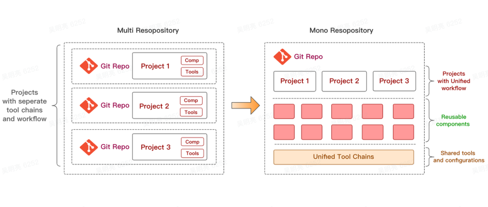
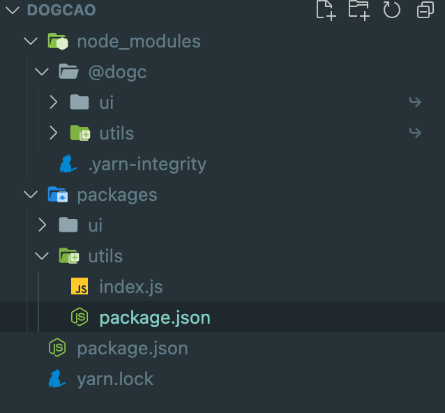

# 组件库如何管理

## 要解决的问题

- 在不发布 `npm` 包的情况下，预览组件。
- 后期如果新增第三方`npm`包，并且组件库对此第三方包有依赖。

上述问题，如果采用传统的`MultiRepo`(多 git 仓库)来管理，操作会变得复杂。因为不同的仓库工作区的割裂，导致复用代码的成本很高，开发调试的流程繁琐，甚至在基础库频繁改动的情况下让人感到很抓狂，体验很差。所以最终决定用`Monorepo`(单 git 仓库)来管理。

## monorepo vs multirepo

`monorepo` 是一种将多个项目代码存储在一个仓库里的软件开发策略。这些项目虽然有可能是相关的，但通常在逻辑上是独立的。相对立的是传统的 `MultiRepo` 模式，即每个项目对应一个单独的仓库来分散管理。



两者各自的优缺点：

**multirepo**

- 优点：
  - 各模块管理自由度较高，可自行选择构建工具，依赖管理，单元测试等配套设施。
  - 各模块体积一般不会太大。
- 缺点：
  - 仓库分散不好找，当很多时，更加困难，分支管理混乱。
  - 版本更新繁琐，如果公共模块的版本发生了变化，需要对所有的模块进行依赖的更新。
  - CHANGELOG 梳理移除折腾，无法很好的自动关联各个模块的变动联系，基本靠口口相传。

**monorepo**

- 优点：
  - 一个残酷维护多个模块，不用到处找仓库。
  - 方便版本管理和依赖管理，模块之间的引用，调试都非常方便，配合相应工具，可以一条命令 g 搞掂。
  - 方便统一生产 CHANGELOG，配合提交规范，可以在发布时自动生产 CHANGELOG。
- 缺点：
  - 统一构建工具，对构建工具提出了更高要求，要能构建各种相关模块。
  - 仓库体积会变大。

基于两者的优缺点，结合组件库的特点：

- 每个包之间是有相关依赖的。
- 统一的构建工具，统一发版。
- 对版本的说明要求较高。

## Monorepo 实践

`Yarn Workspaces`（工作空间/工作区，本文使用工作空间这一名称）是 Yarn 提供的 Monorepo 依赖管理机制，从 Yarn 1.0 开始默认支持，用于在代码仓库的根目录下管理多个 project 的依赖。

### 安装 Yarn

```
npm install -g yarn
```

然后在项目根目录的 packag.json 中增加如下配置：

```
{
  "private": true,
  "workspaces": ["packages/*"]
}
```

以后所有的 开发包放在 packages 目录下进行开发，根目录依赖 packages 内的第三方包：

```
yarn add 开发包包@版本号 -W
```

安装成功之后，就可以正常引用了。目录结构示例：
<br />

